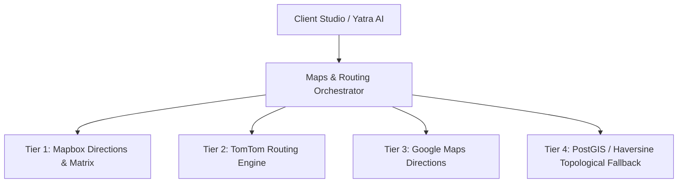

# 🇮🇳 Bharat Safe Yatra — Phase 11.1 API Architecture
## Multi-Tier Service Contract, Matrix Routing & Safe External Adapters

### 1. API Service Endpoints

| Method | Route | Description | Auth / Rate Limit |
| :--- | :--- | :--- | :--- |
| `GET` | `/api/v1/destinations` | Filterable list of verified destinations | Public (100 req/min) |
| `GET` | `/api/v1/destinations/:slug` | Detailed verified destination payload | Public (100 req/min) |
| `POST` | `/api/v1/itineraries` | Create and store custom itinerary | User / Session (60 req/min) |
| `GET` | `/api/v1/itineraries` | Retrieve stored itineraries | User / Session (60 req/min) |
| `POST` | `/api/v1/maps/route` | Turn-by-turn route calculation | Public (60 req/min) |
| `GET` | `/api/v1/maps/geocoding` | Mapbox & Google geocoding resolver | Public (60 req/min) |
| `POST` | `/api/v1/ai/itinerary` | Structured trip proposal from intent | AI Rate Limit (30 req/min) |

---

### 2. Provider Abstraction Layer
Bharat Safe Yatra employs clean provider interfaces to avoid hard vendor lock-in:

---

### 3. Caching, Request Deduplication & Circuit Breakers
- **Route Cache Key**: `route:${mode}:${coordsKey}` (1-hour TTL in memory).
- **Matrix Cache Key**: `matrix:${mode}:${originCoords}->${destCoords}` (1-hour TTL in memory).
- **Circuit Breaker**: Trips to fallback topological router if remote provider errors >= 4 times within a 30-second window.
- **Request Cancellation**: Frontend aborts in-flight route requests when a user rapidly changes destination, preventing race-condition state corruption.
