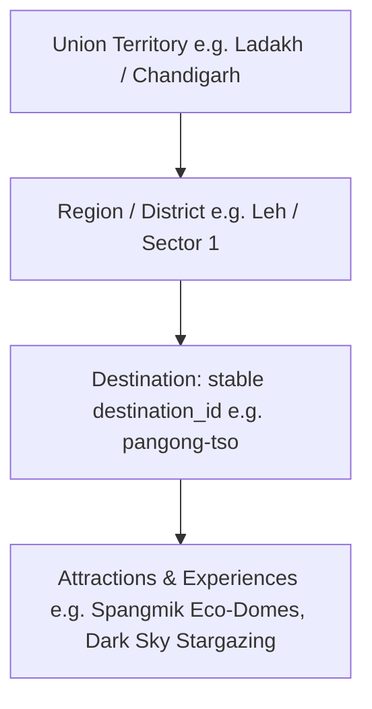

# 🇮🇳 Bharat Safe Yatra — Phase 11.1 Itinerary Architecture
## Next-Generation Itinerary Engine & Complete Destination Control

### 1. Architectural Philosophy & Core Principle
The core, non-negotiable product principle of Bharat Safe Yatra is:
> **The traveller's selected destination is the single source of truth.**

Under no circumstances does the engine silently substitute, default to, or overwrite a traveller's chosen destination. "Khardung La Pass" or "Ladakh" is simply one destination among 48 verified destinations across India's 8 Union Territories. If the traveller selects **Pangong Tso**, the engine plans around Pangong Tso; if **Sukhna Lake**, around Sukhna Lake; if **Kavaratti**, around Kavaratti; if **Red Fort**, around Red Fort.

---

### 2. Destination Hierarchy & Identity

- **Stable Destination Identity**: Every destination is referenced internally by a canonical `destination_id` string (e.g., `sukhna-lake`, `kavaratti`, `pangong-tso`).
- **Hierarchy Preservation**: Destinations exist within their respective Union Territory and geographical cluster.
- **Explicit vs. Recommended**: `selectedDestinationIds` are strictly user-chosen and marked as `isMustVisit: true`. They are never populated from or overwritten by `recommendedDestinationIds`.

---

### 3. Dual Entry Planning Modes

#### Mode A: Destination-First Planning
1. Traveller discovers or selects a destination in the Explorer (e.g. `/destinations/sukhna-lake`).
2. Traveller clicks **"Plan This Trip"**.
3. Itinerary Studio initializes via `/itinerary?destination=sukhna-lake`.
4. The system validates `destinationId`, looks up verified government records, and generates an initial multi-day structure centered on that destination.

#### Mode B: Trip-From-Scratch Planning
1. Traveller navigates directly to `/itinerary` without parameters.
2. The studio renders an empty state prompt: **"Choose a destination to start planning"**.
3. Traveller filters by Union Territory or searches by name across the verified database.
4. Traveller configures Duration (1–2 days, 3–4 days, 5–7 days, 8–14 days, 15+ days), Travel Pace (Relaxed, Balanced, Fast-Paced), and Travellers.
5. Clicking **"Plan Around [Destination]"** deterministically instantiates the itinerary.

---

### 4. Stop Mutability & Must-Visit Protection
- **Must-Visit (`isMustVisit`)**: Selected destinations are flagged as must-visit. During duration scaling or reordering, must-visit stops are protected from automatic eviction.
- **Locking (`isLocked`)**: Travellers can explicitly lock stops in place (🔒). The optimizer cannot move or suggest removing locked waypoints.
- **Manual Adjustments**: Users can reorder, delete optional stops, adjust duration, and advance live progress.
